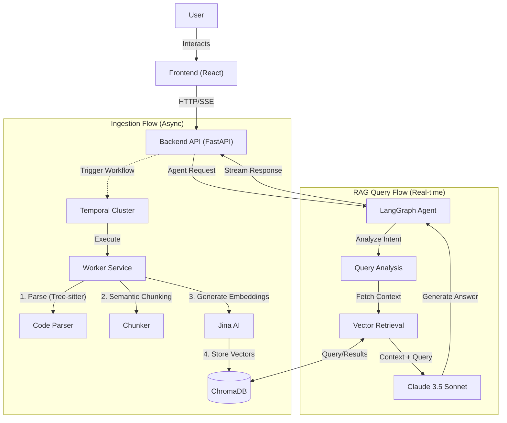

# Code Doc Assistant

## Quick Setup Instruction

To get the application running locally, follow these steps.

### Prerequisites
- Docker & Docker Compose
- Python 3.12+
- Bun 1.3.6
- Anthropic/Jina API Keys (configured in `.env`)

### Steps

1.  **Clone & Configure**
    ```bash
    git clone https://github.com/mkmah/code-doc-assistant
    cd code-doc-assistant/backend
    cp .env.example .env
    # Open .env and add your ANTHROPIC_API_KEY and JINA_API_KEY
    ```

2.  **Start Services (Docker)**
    This spins up Postgres, ChromaDB, and other infrastructure.
    ```bash
    cd infra/docker
    docker compose up -d --build
    ```

    Wait for the services to up then access the app at `http://localhost:3000`.

3.  **Stop Services (Docker)**
    ```bash
    cd infra/docker
    docker compose down
    ```

---

## Architecture Overview

The system is designed as an event-driven, asynchronous RAG pipeline capable of ingesting large codebases and answering complex queries.

### Core Components

1.  **Frontend (React/TanStack Start)**: A modern, responsive UI for uploading codebases (ZIP/GitHub) and chatting. Handles SSE (Server-Sent Events) for real-time streaming responses.
2.  **Backend API (FastAPI)**: REST API handling uploads, query requests, and serving status updates. It acts as the entry point and orchestrator.
3.  **Ingestion Engine (Temporal)**: A durable workflow engine that handles the long-running process of:
    *   Validating and extracting ZIP files.
    *   **Parsing**: Using `tree-sitter` to parse code into ASTs.
    *   **Chunking**: Splitting code into semantic chunks (functions/classes) rather than arbitrary text windows.
    *   **Embedding**: Generating vectors using Jina AI embeddings, the embedding function is added directly while creating the vector collection (chromadb).
    *   **Indexing**: Storing chunks in ChromaDB.
4.  **RAG Agent (LangGraph)**: A stateful graph-based agent that orchestrates the query process:
    *   `QueryAnalysis`: Understands intent.
    *   `Retrieval`: Fetches relevant code context.
    *   `ContextBuilding`: Building context for the query.
    *   `Generation`: Synthesizes answers using Claude.
    *   `Validation`: Ensures query safety.
5.  **Data Storage**:
    *   **ChromaDB**: Vector store for code embeddings.
    *   **PostgreSQL**: Application state (if needed for Temporal/Users).
    *   **Local Storage**: Temporary file storage for uploaded ZIPs.

### Architecture Diagram



---

## Productionization & Scalability

To deploy this scalable architecture to a cloud provider (AWS/GCP/Azure) using Kubernetes, follow these steps:

### Scalability Strategy
*   **Horizontal Pod Autoscaling (HPA)**:
    *   **Backend**: Scale based on CPU/Request throughput.
    *   **Workers**: Scale based on Temporal Task Queue depth. Heavy ingestion loads trigger more workers.
*   **Vector Query Scaling**: Deploy ChromaDB in distributed mode or use a managed service (Pinecone/Weaviate) for production.
*   **Async Processing**: The use of Temporal allows the system to handle thousands of concurrent uploads without dropping requests; they just queue up reliably.

### Kubernetes Deployment Steps

1.  **Containerize**: Build optimized Docker images for `backend`, `frontend`, and `worker`.
    *   `docker build -t app-backend ./backend`
    *   `docker build -t app-worker ./backend -f Dockerfile.worker`
2.  **Infrastructure Provisioning (Terraform/Crossplane)**:
    *   Provision a Managed K8s Cluster (EKS/AKS/GKE).
    *   Provision Managed PostgreSQL (RDS/Cloud SQL).
    *   Provision Object Storage (S3/GCS) for large file storage (replace local disk).
3.  **Deploy Core Services**:
    *   **Temporal Cluster**: Deploy a self-hosted Temporal cluster (Frontend, History, Matching, Worker) or connect to Temporal Cloud.
    *   **ChromaDB**: Deploy as a StatefulSet with PVCs (Persistent Volume Claims) for data capability.
4.  **Deploy Application**:
    *   Create `Deployment` manifests for Backend and Worker.
    *   Inject secrets (API keys) via Kubernetes Secrets or External Secrets Operator.
    *   Configure `Ingress` with TLS termination (Nginx/ALB) to expose the Frontend.
5.  **CI/CD Pipeline**:
    *   Github Actions to build images -> Push to ECR/GCR -> Helm Upgrade.

---

## RAG/LLM Approach & Decisions

### 1. LLM: Anthropic Claude
*   **Choice**: Analyzed GPT-4o vs Claude 3.5 Sonnet.
*   **Decision**: Chosen for its superior coding capabilities and large context window (200k), which is crucial for grasping codebase structure.
*   **Integration**: Accessed via `anthropic` async SDK.

### 2. Embeddings: Jina AI (`jina-embeddings-v4`)
*   **Choice**: Analyzed OpenAI `text-embedding-3` vs Jina.
*   **Decision**: Jina V4 is specifically optimized for code retrieval and long-context specific tasks, outperforming generalist models on code benchmarks. It supports 8k context length, perfect for large functions.

### 3. Vector Database: ChromaDB
*   **Choice**: Analyzed Pinecone vs Qdrant vs Chroma.
*   **Decision**: ChromaDB was chosen for simplicity in local development and ease of self-hosting. It integrates well with Python and supports metadata filtering effectively.

### 4. Orchestration: LangGraph
*   **Choice**: Standard Chains vs Agents.
*   **Decision**: Using **LangGraph** allowed for a cyclic graph architecture. Unlike linear chains, this enables the agent to "self-correct" (e.g., if retrieval is poor, loop back and rephrase query). It provides state management (`AgentState`) to keep track of conversation history and retrieved context.

### 5. Guardrails & Quality
*   **Context Management**: Implemented "Semantic Chunking" using Tree-sitter. Instead of cutting code blindly at 500 characters, we parse the AST and chunk by complete Functions/Classes. This ensures the LLM sees syntactically valid code blocks.
*   **Secret Detection**: Integrated `SecretDetector` (using regex/entropy) to redact API keys *before* embedding, preventing security leaks in RAG.
*   **Observability**: Structured Logging (`structlog`) is used throughout. `LangSmith` (optional) can be easily tapped into via LangGraph.

---

## Key Technical Decisions

*   **Temporal for Ingestion**: Processing a codebase is heavy. It can crash, time out, or hang. Using Temporal workflows ensures that if a worker dies, the job is retried exactly where it left off. It turns a brittle script into a production-grade pipeline.
*   **AST Parsing (Tree-sitter)**: Regex-based splitting fails on complex nested code. Tree-sitter provides a robust AST, allowing us to identify exact function boundaries, docstrings, and dependencies across multi-language projects (Python, TS, Go, etc.).
*   **Async-First Python**: The entire backend uses `asyncio`. This allows the single-threaded Python event loop to handle high-concurrency (e.g., streaming multiple LLM responses while accepting new file uploads) without blocking.

---

## Engineering Standards

*   **Type Safety**: Strictly adhered to Python type hinting. Used `mypy` for static analysis to catch bugs early.
*   **Linting & Formatting**: Used `ruff` for an extremely fast, unified linting/formatting pipeline.
*   **Dependency Management**: Used `uv` (faster replacement for pip/poetry) to manage dependencies implementation, ensuring reproducible builds.
*   **Infrastructure as Code**: `docker` is the source of truth for local dev.
*   **Skipped**:
    *   **Unit Test Coverage**: Aimed for critical paths, but overall coverage is not at 100% due to time constraints.
    *   **E2E Testing**: Full browser-based testing (Playwright) was skipped in favor of API integration tests.

---

## AI Tools Usage

*   **Boilerplate Generation**: Used AI to scaffold the initial FastAPI structure and Pydantic models.
*   **Test Generation**: Leveraged AI to generate unit test cases for the `VectorStore` adapter and edge cases for regex patterns.
*   **Docstrings**: Used AI to auto-generate comprehensive docstrings for complex graph nodes.
*   **Code Generation**: Used AI to generate code for the `VectorStore` adapter and edge cases for regex patterns.
*   **Code Parsing**: Used AI to parse the codebase and generate a knowledge graph of the code.
*   **Frontend**: Used AI to generate most of the frontend code.

---

## What I'd Do Differently

With more time, I would:
1.  **Implement Hybrid Search**: Currently using dense vector search. I would add a keyword-based index (BM25) and use Reciprocal Rank Fusion (RRF) to merge results, improving accuracy for specific variable names/identifiers.
2.  **GraphRAG**: Instead of just chunking, I would build a Knowledge Graph of the code (Class A inherits Class B, calls Function C). Querying this graph would answer "What is the impact of changing this class?" much better than vector search.
3.  **Evaluation Pipeline**: Build a dataset of "Code Question -> Ground Truth Answer" and run automated metrics (Ragas) to score my RAG pipeline's precision/recall.


## What will I add

1. **Efficient File Upload**: Currently all files are not being uploaded, the files are being skipped while parsing the codebase. This can be improved.
2. **UI/UX**: The UI/UX can be improved.
3. **Save chats**: Currently the chats are not being saved, the chats are being lost after the session.

---
